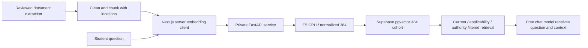

# V1 embedding infrastructure — local E5

Human update: 5 October 2026, [unaltered specification](../requirements/sources/2026-10-05-local-e5-embedding.md). This supersedes the earlier choice to select V1 embeddings in the normal Provider UI; generation remains FREE_ONLY with Zen/OpenRouter as the primary services. Implementation/evidence lives in [execution plan](../superpowers/plans/2026-10-05-yru-local-e5-embedding.md), [task board](../tasks/V1_TASK_BOARD.md) and the dated component report. This document is a contract, not a completion claim.

## Selected vector space

- `intfloat/multilingual-e5-small`, CPU, 384 dimensions, normalized vectors. No GPU, Ollama, alternative model or model download is needed when the existing cache works.
- Pin the already observed cached revision `614241f622f53c4eeff9890bdc4f31cfecc418b3`. A later weight/prefix/normalization change creates a new vector cohort and requires reviewed reindexing; an endpoint move does not.
- Raw questions receive exactly one infrastructure-added `query: ` prefix; raw document chunks receive `passage: `. These are required also for Thai text by the [model card](https://huggingface.co/intfloat/multilingual-e5-small/raw/main/README.md). Callers pass unprefixed text.
- The E5 tokenizer limit is 512 tokens including the prefix/special tokens. Reject oversized input instead of silently truncating published evidence. Clean/chunk work must preserve source locations and warnings; no blanket corpus import or approval.

## Boundaries and flow

All embedding HTTP finishes outside SQL transactions. The internal `EmbeddingProvider` exposes `embedQuery`, `embedPassages`, `healthCheck`, `dimension`, model/revision/fingerprint. V1 has one default `LocalE5EmbeddingProvider`. The existing external embedding adapters are retained as internal compatibility code, not the default or a requirement for dashboard configuration. The configured RAG producer and `embedConfigured` use local E5. Existing generation/routing/LINE ownership fences are unchanged; live generation remains disabled until foundation and reviewed knowledge gates pass.

## Cache and service

`services/embedding/` owns FastAPI source, service-specific `.env.example`, pinned installed dependencies, tests and startup documentation. Its ignored `.env` sets `EMBEDDING_MODEL_CACHE_DIR`; this machine uses `D:\AI\Models\huggingface`. Application source contains no username or machine-specific path. Set `HF_HOME` to that root, and the hub/SentenceTransformers cache to its `hub` directory before importing model libraries. Load the fixed snapshot with `local_files_only=True`, offline flags and no remote code; fail if files are absent rather than falling back to C: or downloading.

Copy the existing model repository subtree while preserving `hub/models--…/{refs,blobs,snapshots,.no_exist}`. Verify content hashes and an offline load from the destination. Preserve C:; report whether the selected model cache can be removed after verification, but never remove it automatically. Other Hugging Face models/tokens are outside the cleanup claim. Neither weights, `.venv`, generated caches nor service `.env` belong in Git or the Next.js bundle.

Minimum API: `GET /health` and `POST /embed` with `{text,type:"query"|"passage"}`; bounded `/embed/batch` may support passages. Health reports model/revision/dimension/healthy state, never paths. Encode uses CPU, a bounded input/token count and serialized model execution. Failures return fixed codes and do not log input text or credentials.

Inference responses also carry the selected model/revision; backend validates both for every vector, not only a health probe. `prepareEmbeddedKnowledgeChunks` accepts reviewed extracted pages, keeps source page/section locations through the existing chunker, refuses unresolved review pages, performs bounded passage batches and returns vector drafts with fingerprint/dimension. It performs no SQL/publication or real-corpus import; approval/publication integration remains M7 work.

## Backend and deployment

Server configuration: `EMBEDDING_MODEL`, `EMBEDDING_DIMENSION`, `EMBEDDING_MODEL_REVISION`, `EMBEDDING_API_URL`, optional `EMBEDDING_API_KEY`. Default development endpoint is `http://127.0.0.1:8000`; non-loopback endpoints require HTTPS and an authentication key. Client enforces timeout/cancellation, bounded response reads, Zod response validation, finite nonzero normalized 384-float vectors and exact model/revision health. Remote URLs cannot come from browser/model arguments; no redirect following or endpoint/key disclosure in UI/errors.

Service binds loopback by default. A non-loopback bind requires authentication configured before startup; production termination uses private networking/TLS. Deployment changes the URL/key, not RAG code or vector fingerprint. CPU service throughput and deployment networking need measurement on the actual host; a local successful request is not a fleet/deployment claim.

## Exact passage counting prerequisite

IMP-03B-2 / EMB-TOK-01 adds private `POST /tokens/count` using the already loaded pinned tokenizer. The strict passage batch contract is 1–16 raw texts, ≤6,000 UTF-8 bytes each; the service counts one infrastructure-added `passage: ` prefix with special tokens and `truncation=False`. It reports ordered positive counts, including values above512 for splitting, and never encodes or returns input text. Counting and inference share the non-queuing CPU lock; busy returns a fixed503. A `PassageTokenCounter` capability belongs to the concrete local E5 infrastructure, not normal Provider UI or unrelated generation/embedding adapters. The backend checks exact model/revision/dimension, integer count bounds/cardinality and existing bounded HTTP/deadline/cancellation. Responses are private no-store; validation errors have fixed diagnostics without echoed source text. The service bounds request bodies at600,000bytes (including escaped JSON), before parsing. No SQL or publication is introduced by counting. All-format located preparation, review-bound chunk plans and persisted location/citation acceptance remain Task4C follow-up in the import plan.

## Database transition

Keep applied migrations unchanged and preserve historical generic `embedding` values/cohorts. Add a generated `embedding_e5 vector(384)` projection only for the fixed local-E5 fingerprint, plus a constraint rejecting non-384 dimensions with that fingerprint. E5 retrieval selects that column and casts query vectors to `vector(384)`; older internal cohorts retain the existing path. Existing metadata/fingerprint/dimension indexes and exact cosine search remain; no unbenchmarked ANN index is added. Wrong-dimension tests cover both backend and PostgreSQL, including preservation of legacy rows. There is no automatic conversion, deletion, re-embedding or approval of old chunks.

## Normal administrator experience

Provider/Model forms manage generation/reasoning: up/down ordering, per-model observations, quota and test actions remain. Remove normal embedding selection/dimension fields and the Embedding purpose tab. Do not delete historical registry rows. Show a read-only Embedding Service panel with model, 384, Local, observed connection/health/time and a controlled unavailable state. The browser calls only the authenticated Next.js surface; never the FastAPI URL. Do not show local filesystem paths, endpoint, key or raw error.
