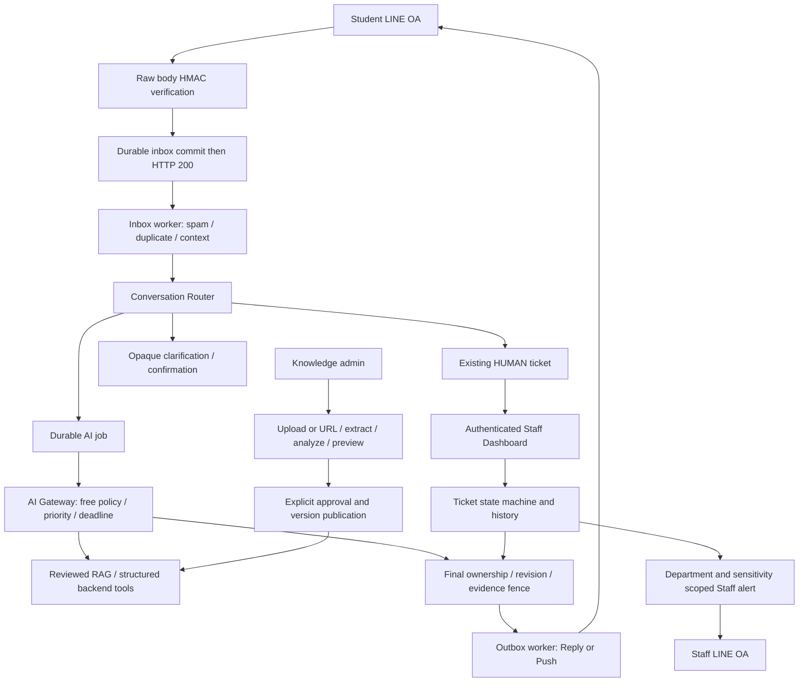
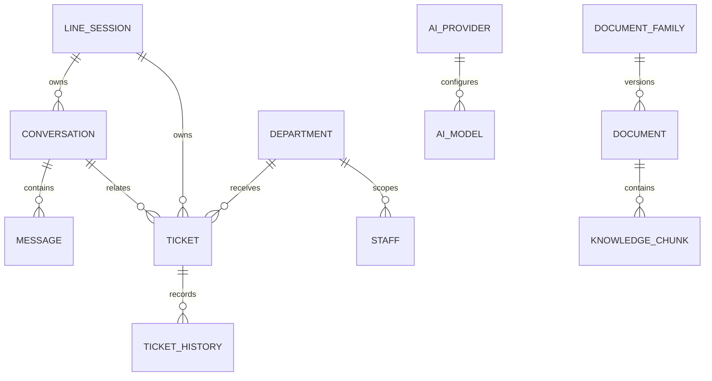
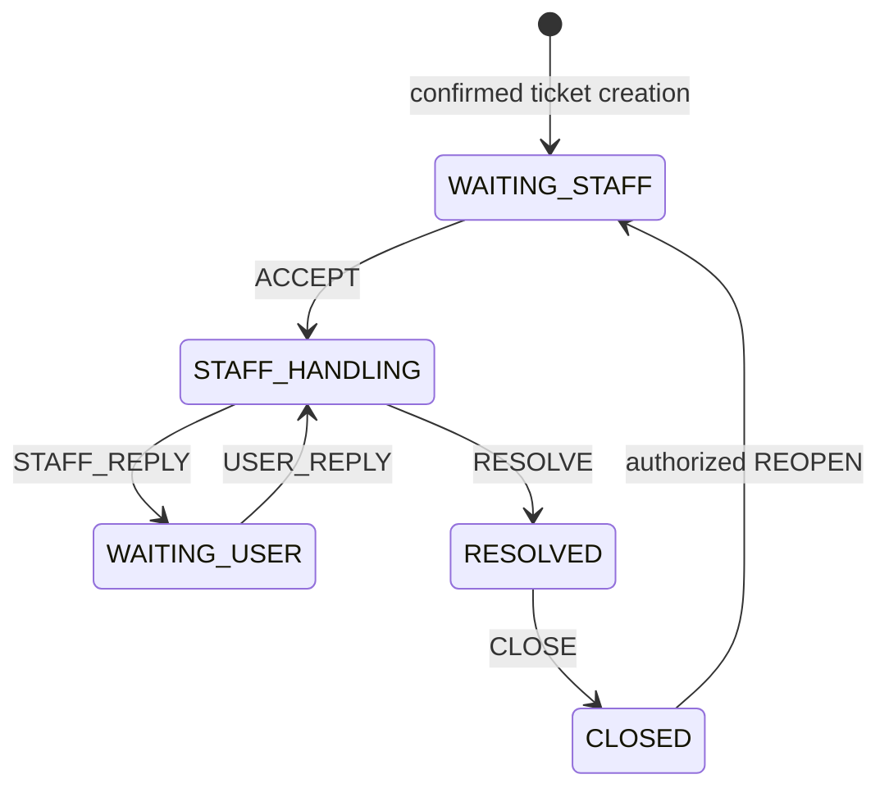

# YRU V1 — System design

เอกสารรวม architecture วันที่ 4 ตุลาคม 2026 ใช้กับ [master guide](../../CODEX_IMPLEMENTATION_GUIDE_YRU_AI_HELPDESK.md), [ต้นฉบับ](../requirements/sources/README.md), [matrix](../requirements/V1_REQUIREMENTS_MATRIX.md) และ [task board](../tasks/V1_TASK_BOARD.md). แยก **มี implementation/evidence** ออกจาก **planned** ไม่ถือว่า diagram คือสิ่งที่ทำเสร็จทั้งหมด

## System boundaries

5 October human update: default embeddings are local CPU `intfloat/multilingual-e5-small` / 384, through private FastAPI called only by Next.js backend. [Embedding design](EMBEDDING_SERVICE_DESIGN.md) owns cache/offline/prefix/configuration/typed-vector contracts. Normal Provider UI configures generation/reasoning; embedding health is read-only. Historical external adapters are compatibility code. Generation remains FREE_ONLY; foundation/import/publication/full-flow acceptance stays explicit.

Student OA เป็นช่องทางถาม/ตอบ anonymous; Staff OA เป็น alert/bind/action/เปิด Dashboard ไม่เป็น LINE ส่วนตัวที่คุยกับนักศึกษา. Staff Dashboard ใช้ Supabase Auth; backend ตรวจ department/sensitivity/active role ก่อนอ่านหรือเปลี่ยนงาน. Supabase PostgreSQL/Auth/pgvector เป็น data layer; Storage/import acquisition เพิ่มใน M7. Gateway คุม runtime generation ตาม FREE_ONLY และ priority; embeddingsใช้local E5 infrastructure. University เพิ่ม paid generation option ผ่าน UI ภายหลัง

Diagram เป็น target flow: ingestion/queues/ticket/fenced RAG มี component evidence; free adapters/Provider UX, import/structured/full binding/incidents ยังมีงาน pending ตาม board. ไม่มี unrestricted SQL/search/publish จาก AI

## Anonymous identity และ persistence

LINE technical identity encrypted/private server boundary; browser/UI เห็น anonymous code. Studentไม่มี login/student profile; Staff identity เป็น Auth subject → active staff/permissions. Message/conversation/ticket มี ownership และ revision แยกกัน; new topic ไม่ถูกดูดเข้าตั๋วที่กำลัง HUMAN

Logical relationships ด้านล่างย่อจาก schema ปัจจุบัน ไม่ใช่ ER diagram ของทุก physical constraint:

Actual SQL source อยู่ใน `supabase/migrations/`; ตัวอย่างชื่อตาราง/ไฟล์ในคู่มือไม่บังคับให้ duplicate schema เมื่อ behavior มี implementation เดิม เช่น ticket messages ผ่าน `messages.ticket_id`, versions ผ่าน documents/version_stream. Mapping ต้องมี acceptance ไม่ลบ requirement เพื่อให้ชื่อเข้ากัน

## Conversation และ ticket state

8October RAG-01A [semantic context design](AI_CONTEXT_ROUTING_DESIGN.md)/[component evidence](../reports/SEMANTIC_CONTEXT_ROUTING_REPORT.md) binds the configured free gateway in the production inbox worker. Ephemeral labels and actual USER snapshots commit before HTTP; bounded proposals map only after fresh lease/context checks. Unknown/low-confidence/stale results retain explicit owned choices. Business intent/troubleshooting and full sourced/live FlowE remain separate acceptance.

Router outcome: existing context, new AI conversation, context question หรือ blocked/spam. Context choice ใช้ opaque signed/owned/expiring tokens; ticket creation ต้อง confirmation backend-owned. AI classification เป็น structured proposal ที่ตรวจ against user text/applicability/active departments; ไม่ใช้ keyword เป็น final router

State machine มี implementation ใน `lib/conversation/state-machine.ts`:

Schema ยังมี NEW/AI_HANDLING/CANCELLED แต่ service ไม่อนุญาต arbitrary transition. ACCEPT ตั้ง HUMAN; AI job/result/outbox ต้องตรวจ ownership/mode/revision อีกครั้งก่อนส่ง; เฉพาะ conversation ของ ticket นั้นถูกยับยั้ง new AI topic ยังคุยได้. เจ้าหน้าที่เป็นผู้ resolve/close; late reply ใช้ queued push ผ่าน Student OA และมี audit/idempotency

## Durable boundaries และ race handling

- Webhook อ่าน raw bytes ตรวจ HMAC ก่อน JSON; valid empty events ตอบ 200. Durable path commit inbox ก่อน ACK; ไม่มี model call ใน webhook transaction
- Inbox/outbox/AI jobs ใช้ leases/order/retry/idempotency; classify unsupported events โดยไม่สร้าง Student identity จาก Staff OA
- AI worker snapshot ใน short transaction → generation/embedding/search HTTP นอก transaction → stored result → reauthorize/revision/evidence checks → atomic message/outbox/job finalization. Retry ที่มี saved result ไม่ regenerate
- LINE dispatch revalidates HUMAN/revision และ eligible citations. Publication ใช้ sorted family locks ก่อน document locks ก่อน row locks; delivery ใช้ matching session/family/document fence ตาม M6 plan/report. ห้ามข้าม fence เมื่อ M7 เพิ่ม version/amendment
- Runtime tools มี allowlisted parameters/owned confirmation/atomic receipts. Structured seven-dataset tool ตอนนี้ fail explicit จน M8; web/similarity ยัง planned ไม่ถือว่า stub ผ่านแล้ว

## AI Provider

Contract รายละเอียดอยู่ใน [AI provider design](AI_PROVIDER_DESIGN.md). Default FREE_ONLY ครอบคลุม generation/test และ deterministic bounded fallback; embeddingsใช้local E5 infrastructure. Provider/Model ordering, HTTP observation, quota scope และ selected-model probe เป็น requirement ของ generation UI ไม่ลดเหลือ server priority field/one health badge

PRV-01…05 automated prerequisiteผ่าน [provider acceptance](../reports/PRV_COMPATIBLE_ACCEPTANCE_REPORT.md): verified free Zen/OpenRouter/order/status/probes/cooldown/compatible configuration. Live free quality/account evidenceยังpending; M7เดินต่อหลัง gatesจริง ไม่เปลี่ยนลำดับmasterเพื่อเลี่ยงgap

## RAG และ versioned knowledge

Metadata scope: PUBLIC/reviewed/approved, official source, current/effective, family/year/audience/student type, authority, department แล้วจึง similarity/freshness. Historical question ระบุปี/date ที่มาจาก user; ambiguity ให้ถามกลับ ไม่ปล่อย LLM เดา current academic year/cohort

Chunks มี document/page/section/source provenance; citations สร้างจาก IDs ที่ retrieval ส่งจริงไม่รับ URL/title/page ที่ model แต่ง. Embedding cohort แยก fingerprint/dimension/provider/model configuration ไม่ผสมเวกเตอร์ข้ามรุ่น. Exact prefiltered distance ใช้กับ shortlist; ANN ยังต้องเลือก cohort/วัด recall

Document family/version streams มี current uniqueness และ history. Current replacement เปลี่ยน oldเป็น SUPERSEDED ไม่ delete; supplemental document ไม่แทน base. AMENDS ต้อง retrieve base+active amendments และ publication อนุมัติ relationships — schema มีแล้ว แต่ behavior/UI ยังเป็น IMP-03

## Import และ fixed structured data — Partial

Target: PDF/DOCX/XLSX/CSV/URL → private original/checksum → bounded extraction → quality/sensitivity flags → family/department/date/authority/classification proposal → editable version-conflict preview → explicit approval → atomic version/chunks/dataset publication

PUB-01…05 RAG path is component-accepted: complete saved review/located plan,exact atomic publication/immutable receipt,relationship/family/dispatch fences and private deliberate approval UI/API.10actual isolated browser groups and1439unit/type/lint/build pass;187PG/foundationRLS covers unchanged backend. [Approval evidence](../reports/IMP_PUBLICATION_APPROVAL_REPORT.md). Actual PDF400/409 recovery retains bytes/text/cells/row ordinals with explicit warnings;[recovery](../reports/IMP_PDF_RECOVERY_REPORT.md). Published family/current/history catalog remains PUB-06; M8 mapper preview and atomic STRUCTURED/BOTH are unimplemented. No real corpus/public approval/live generation claim.

แผน M7 เดิมเริ่ม PDF/HTML slice; **ไม่ครบ V1 file types** จึงมี IMP-02 ต่อ DOCX/XLSX/CSV และ tests. Storage/encryption/access/retention ต้องมี plan ก่อน implementation ไม่อ้างว่ามี Supabase bucket พร้อมแล้ว. Low-quality/OCR/cohort/source warnings อยู่ PENDING_REVIEW จนคนตรวจ ไม่มี publish อัตโนมัติ

M8 registry จำกัด 7 datasets: `academic_calendar_events`, `tuition_fees`, `transfer_courses`, `university_services`, `university_systems`, `service_forms`, `announcements`. Exact dates/fees ใช้ validated structured query และ citation/version. Unknown dataset → RAG proposal/manual schema change ภายหลัง ไม่ AI DDL และไม่มีตารางรายปี

## Advanced และ operations — Planned / partial

Staff alerts ส่งเฉพาะ active/bound/authorized staff ที่เข้า ticket scope; general/sensitive payload แยกให้เหมาะสม. M4 มี bound-recipient notification component แต่ binding management/complete OA UX ยัง ADV-01. Similar issue → incident/severity rules, loading indicator, official-first web fallback และ usage/log/analytics/settings/departments ยังต้อง acceptance ตาม board

Staff-only AI assistanceระหว่างHUMANต้องแยกflow: authorizedstaffขอสรุป/แนะนำreply/knowledge/similartickets/route/severity → validatedgateway/tools → draftในDashboard. Studentไม่รับผลจนstaffกดส่งผ่านStaffReplyAPIตามstate machine. Master§52ต้องมีsummary/relatedtickets/knowledgecoverage ไม่ถือว่ามีmessagehistoryแล้วครบ

Dashboard modulesเป้าหมายมี **13**: Overview, Tickets, Incidents, Departments, Knowledge Base, Activities, AI Providers, AI Models, Fallback Rules, Usage, Analytics, Logs, Settings. ไม่จำเป็นต้องเป็น13routesแยก; Providers/Models/Fallbackอยู่surfaceเดียวได้แต่ต้องมีacceptanceของทุกfunction. Overview8metricsในต้นฉบับต้องมาจากจริง: Questions Today, AI Resolved, Human Escalations, Open Tickets, Urgent Tickets, Active Incidents, Common Problems, AI Provider Status. ไม่มีStudentManagement/ตัวเลขfixtureในruntimeUI

Rich Menuในต้นฉบับ§20เป็นข้อเสนอสำหรับprimaryentry (AskAI/MyTickets/Guides/ContactStaff) ไม่แทนcontextQuickReply. เก็บเป็นplannedoption ADV-05; ต้องระบุdecisionก่อนทำหรือdefer ไม่หายจากแผนเพราะไม่มีในchapterอื่น

Deployment ต้องมี web + inbox/outbox/AI/import workers ที่มี lifecycle ชัดเจน ไม่สมมติว่า route บน Vercel จะเป็น continuous worker. Production hosting/domain/backup/storage/observability เป็น final deployment contract ที่ยังไม่เลือก

## การตรวจรับ

Current M7 catalog/assistance contracts: [approved administrative inventory](KNOWLEDGE_CATALOG_DESIGN.md), [private prepared metadata](IMPORT_ASSISTANCE_DESIGN.md), [browser API boundaries](../operations/BACKEND_UI_CONTRACTS.md). Root supplies read-only backend/auth/SQL/revision/retention evidence; Gemini owns separate Dashboard presentation and submits commits for combined acceptance. No migration or normal-provider embedding change is introduced. See [current backend report](../reports/KNOWLEDGE_CATALOG_ASSISTANCE_BACKEND_REPORT.md) rather than treating an API component pass as full UI/usability/V1 evidence.

Unit/property behavior + actual PostgreSQL/RLS/concurrency + signed HTTP + authenticated browser ตรวจ component. Flow A–F ตรวจ business behavior ข้าม subsystem และแยก controlled mock transport จาก live free provider/OA. คำสั่ง/หลักฐานอยู่ใน reports; manual gates อยู่ใน [final setup checklist](../operations/FINAL_SETUP_CHECKLIST.md)

Document checkpoint นี้ไม่ได้รัน application build ใหม่ และไม่ทำให้ pending pricing RED test ผ่าน การปิด milestoneต้องตรวจ source ที่รวมแก้แล้วจริง ไม่เอาจำนวน tests ก่อนแก้มาอ้าง whole completion
