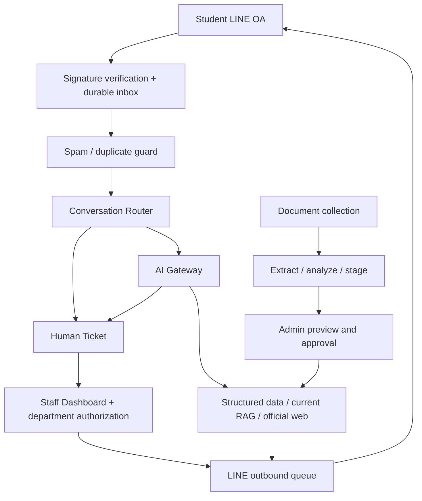

# YRU AI Helpdesk Implementation Plan

> **For agentic workers:** เมื่อเริ่มพัฒนา ใช้ `superpowers:subagent-driven-development` หรือ `superpowers:executing-plans` ทำทีละงานและตรวจรับก่อนงานถัดไป

**Goal:** สร้าง AI Student Support ผ่าน LINE ที่ตอบจากข้อมูล YRU และส่งต่อเจ้าหน้าที่ได้ โดย V1 ไม่สร้างฐานข้อมูลนักศึกษา

**Architecture:** Next.js รับ LINE webhook และให้ backend ตรวจสิทธิ์/ดำเนินการผ่านบริการที่มีขอบเขตชัดเจน ใช้ Supabase เก็บ conversation, ticket และ knowledge ที่มี version ส่วน AI วิเคราะห์ภาษาและเรียกเครื่องมือที่ backend อนุญาต

**Tech Stack:** Next.js App Router, TypeScript, Supabase PostgreSQL/Auth/Storage/pgvector, Zod, LINE Messaging API, Vitest และ integration tests

**สถานะ:** แผนก่อนพัฒนา ตรวจ workspace วันที่ 4 ตุลาคม 2569 พบเพียง master guide ยังไม่มี package.json, source code หรือ Git repository ผู้ใช้ยืนยันลำดับ LINE → Ticket → AI/RAG แล้ว เอกสารนี้เป็น roadmap และใบแบ่งงาน; ก่อนเขียนแต่ละ Phase ต้องแตกเป็นแผน implementation เฉพาะ Phase พร้อม schema/API/test cases ที่ตรวจรับได้

**Repository:** ผู้ใช้แจ้ง `git@github.com:Ming0807/line-ai-support.git` ภายหลัง ตรวจ HTTPS `git ls-remote` สำเร็จแต่ไม่มี refs จึง initialize Git ใน workspace เดิมและตั้ง origin fetch ผ่าน HTTPS / push ผ่าน SSH ยังไม่มี commit หรือ push; SSH เครื่องนี้ตอบ `Permission denied (publickey)` ต้องแก้ authentication ก่อน push ทาง SSH

## Global Constraints

- Master specification: `CODEX_IMPLEMENTATION_GUIDE_YRU_AI_HELPDESK.md` เป็นแหล่งข้อกำหนดหลัก
- Anonymous V1: ห้ามสร้าง students/student_profiles/student_grades/registered_courses
- LINE OA #1 สำหรับนักศึกษา; OA #2 สำหรับแจ้งเจ้าหน้าที่ตามหน่วยงาน
- ไม่ใช้ LINE ส่วนตัวเจ้าหน้าที่ในการคุยกับผู้ใช้
- AI ห้าม arbitrary SQL; backend validate และตรวจสิทธิ์ทุกเครื่องมือ
- HUMAN mode ห้าม AI ตอบอัตโนมัติใน conversation/ticket นั้น แต่เรื่องใหม่เปิด AI conversation ได้
- Migration เปลี่ยน schema; Import เปลี่ยนข้อมูล ไม่สร้าง table ตามปีหรือเอกสาร
- เอกสารต้องผ่าน preview/approve ก่อน ACTIVE; เก็บฉบับเดิมและความสัมพันธ์ amendment
- Staff UI ไม่เห็น raw LINE userId หรือ provider secrets
- ไม่ broadcast ticket ทุกหน่วยงาน; จำกัด sensitive ticket เพิ่มจาก department permission
- ลำดับ Phase ตามคู่มือ ห้ามเปิดพัฒนาทุก subsystem พร้อมกัน

## ภาพรวมและทางเลือก

แนะนำทำตาม Phase ของคู่มือ เพราะระบบต้องมีทางส่งต่อเจ้าหน้าที่ได้จริงก่อนเพิ่ม AI ทางเลือกที่สองคือทำ FAQ/RAG demo ก่อน ซึ่งสาธิตการตอบเอกสารเร็วแต่ยังพิสูจน์ human takeover ไม่ได้ ทางเลือกที่สามคือเริ่มทุก module ขนานกัน ซึ่งเสี่ยง contract/schema ขัดกันและตรวจรับยาก จึงไม่เลือก



## ประเด็นที่ผมรับผิดชอบตัดสินและตรวจเอง

1. **Durable processing:** verify raw request signature → insert inbox event ที่ unique ด้วย LINE webhookEventId → ตอบ HTTP 200 หลัง commit สำเร็จ → worker ประมวลผล อย่า return 200 แล้วฝากงานไว้ใน promise ที่ serverless อาจยุติ ใช้ retry ที่ idempotent และ outbound outbox
2. **Race ตอน takeover:** ก่อนส่ง AI reply ตรวจ conversation mode/revision อีกครั้ง; accept ticket และเปลี่ยน conversation mode ต้อง atomic ข้อความ AI ที่เริ่มทำก่อน accept ต้องถูกระงับถ้า mode เปลี่ยน
3. **Scope ของ current document:** ใช้ family + department + document type + audience/student_type + academic_year/semester + program/curriculum/cohort ที่เกี่ยวข้อง ปฏิทินภาคปกติและ กศ.บป. ใช้พร้อมกันได้ ไม่ supersede กันเพียงเพราะอยู่ family เดียวกัน
4. **Ticket states:** master guide กล่าวถึง REOPENED แต่ enum ไม่มี state นี้ ให้ REOPENED เป็น audit action ที่ CLOSED → WAITING_STAFF เฉพาะ policy/role อนุญาต; CANCELLED ต้องมี transition ที่ตรวจสิทธิ์; การกลับ AI ต้องเกิดหลัง close ตาม flow ที่ตกลง
5. **Import transaction:** download/extract/embedding ทำใน staging ก่อน publish; transaction DB สั้นสำหรับเปลี่ยน version + activate chunks/rows + complete job + audit ไม่ครอบ network API calls ไว้ใน transaction และไม่ทำฉบับเก่าหายถ้า embedding ล้มเหลว
6. **Database boundaries:** RLS ต้องมีตั้งแต่ Phase 1; service role ใช้เฉพาะ server; code ฝั่ง dashboard ต้องไม่สามารถ bypass department/sensitive rules
7. **LINE deadlines/cost:** worker ต้องคุม total budget รวม fallback; reply token ใช้ตามข้อจำกัด LINE ปัจจุบัน ตรวจจาก official docs ก่อนพัฒนา; staff replies/notifications ใช้ push และต้องนับ quota ไม่มีสมมติฐานว่าใช้งานทั้งหมดฟรี
8. **Thai document quality:** ตรวจ PDF scan/font extraction/cohort/effective dates ก่อนเปิดใช้งาน; ข้อมูลวันที่และค่าธรรมเนียมต้องเทียบตาราง/ภาพต้นฉบับ
9. **Sensitive data:** ชุดเก็บนี้เน้นคู่มือ/แบบฟอร์ม/ระเบียบ ไม่เก็บรายชื่อ ผลสอบ เกรด หรือข้อมูลรายบุคคลเข้า public RAG
10. **Supabase configuration ปัจจุบัน:** ตรวจ Data API exposed schemas/table grants แยกจาก RLS; ก่อนแก้ PostgreSQL จริงอ่าน supabase-postgres-best-practices และตรวจ CLI help/version ชื่อ migration 001–017 ใน guide เป็นลำดับแนวคิด ใช้ไฟล์ timestamp ที่สร้างด้วย Supabase CLI ใน implementation จริง

## การแบ่งงานและโมเดล

ใช้ subagent `gpt-6-luna` ตามที่ผู้ใช้ขอ: **high** สำหรับงานขอบเขตชัดเจน; **max** สำหรับ logic ที่มีหลายเงื่อนไข ผมรับ architecture, contract, schema/RLS, security boundaries, integration และ final verification เอง จำนวนที่เปิดพร้อมกันไม่เกิน 3 subagents และไม่ให้แก้ไฟล์ร่วมกัน

| งาน | ความยาก | ผู้ทำ / reasoning | Dependency | สิ่งที่ตรวจรับ |
|---|---|---|---|---|
| รวบรวมกิจกรรมนักศึกษา/หอพัก | ปานกลาง | Luna high | แผนนี้ | ไฟล์จริง + source + checksum + cohort/gap report |
| รวบรวม IT/Passport/M365/ห้องสมุด | สูง เพราะ source กระจาย | Luna max | แผนนี้ | PDF/HTML จริง + provenance + รายการที่ยังขาด |
| รวบรวมทะเบียน/ปฏิทิน/ค่าเทอม/เทียบโอน | สูง | ผม | แผนนี้ | manifest, ตรวจ PDF, completeness 19 families |
| Project bootstrap + env + Staff login UI | ปานกลาง | Luna high | contract Phase 1 | build/typecheck/login acceptance |
| Inbox/outbox, identifier protection, database/RLS | สูงมาก | ผม | runtime/deployment choice | duplicate/retry/privacy/department tests |
| Ticket list/detail/filter UI | ปานกลาง | Luna high | Ticket DTO/API stable | role-aware data, loading/error/form validation |
| State machine/router/ambiguity logic | สูง | Luna max เสนอ implementation; ผม review | fixtures/contracts/RLS | multi-ticket, invalid transitions, new topic during HUMAN |
| Human takeover + outbound integration | สูงมาก | ผม | ticket core | accept race, retry, no duplicate sends |
| AI adapters/fallback/usage | สูง | Luna max | provider contract โดยผม | total timeout budget, 429/5xx/fallback/tool idempotency |
| Parser/chunking/preview UI | ปานกลาง | Luna high | import staging contract | page provenance, low quality flags, preview |
| Version resolver/metadata filter | สูง | Luna max; ผมดู transaction/model | scoped document contract | audience/year/amendment/history tests |
| Publish transaction / structured mapper | สูงมาก | ผม | staging validation | rollback, old version retained, exact row mapping |
| Incidents/provider dashboard/analytics | ปานกลาง–สูง | Luna high/max ตามชิ้น | Phase 1–6 ผ่าน | thresholds, department scope, usage correctness |
| Integration tests/deployment review | สูงมาก | ผม | ทุก Phase ผ่าน | Flow A–F และ permissions/failed delivery |

## Phase 0 — แผนและชุดเอกสาร (งานรอบนี้)

- [x] อ่าน master guide และข้อความแนบ ตรวจ workspace
- [x] ยืนยันลำดับพัฒนากับผู้ใช้: LINE → Ticket → AI/RAG
- [x] เขียน roadmap และขอบเขตเจ้าของงานก่อนเปิด subagent
- [x] ค้นทางการและเก็บเอกสารที่ `documents/yru/`
- [x] รวม manifest/checksum/source URLs พร้อมผลดาวน์โหลดที่ล้มเหลว
- [x] ตรวจ 19 document families ในคู่มือ และแยก coverage จาก publish readiness
- [x] จัด demo shortlist และรายงานเอกสารที่ต้อง OCR/ตรวจเวอร์ชัน/ตรวจกลุ่มผู้ใช้

ผลรวม Phase 0: เก็บ 154 PDFs + 33 HTML snapshots รวม187resources ตรวจ checksum/bytes ผ่าน; คัด 15 แหล่งสำหรับ Demo และคัดกรอง PDF89รายการว่าต้อง OCR/font review พบแหล่งอ้างอิงครบ19หมวด แต่ Passport/M365/กิจกรรมบางcohortยังมีช่องว่าง รายงานละเอียดอยู่ที่ `documents/yru/COMPLETENESS.md` ตัวเลขนี้เป็นผลรวบรวม ยังไม่ใช่เอกสาร approved/indexed

ไม่สร้างแอป migration หรือเชื่อม production ในรอบวางแผนนี้

## Phase 1 — Foundation

**Files:** `package.json`, `app/(auth)/login/page.tsx`, `lib/config/env.ts`, `lib/supabase/{client,server,admin}.ts`, `lib/auth/{permissions,roles}.ts`, `lib/line/signature.ts`, `app/api/line/student/webhook/route.ts`, `lib/line/{inbox,outbox}.ts`, `supabase/migrations/001_extensions.sql` ถึง `006_ticket_history.sql` พร้อม RLS ของตารางที่เปิดใช้, `.env.example`, `README.md`

**Contract:** server-only `recordWebhook(rawBody, signature)` รับ events ที่ผ่าน signature; unique webhookEventId; `enqueueOutbound(messageKey, sessionId, payload)` ใช้ messageKey เป็น idempotency key; staff profile อ้าง Supabase Auth และ department; LINE ID เก็บ encrypted/protected backend พร้อม keyed hash สำหรับ lookup

- [ ] ผมกำหนด schema/DTO และ worker deployment ที่รองรับ durable inbox
- [ ] Luna high ทำ bootstrap/env/login ตาม contract
- [ ] ผมทำ webhook/inbox/identifier/RLS และ integration
- [ ] ตรวจ signature ผิดต้อง reject โดยไม่เรียก AI, redelivery ไม่เพิ่ม message ซ้ำ, staff login ได้ และ staff ต่าง department อ่านกันไม่ได้
- [ ] รัน `pnpm lint`, `pnpm typecheck`, `pnpm test`, `pnpm build`; SQL/RLS ทดสอบบน local Supabase ที่ setup ใน Phase นี้

**Gate:** LINE → message DB และ Staff Login ผ่านจริง จึงเริ่ม Phase 2

## Phase 2 — Ticket Core

**Files:** `lib/conversation/{router,state-machine,context-resolver,quick-reply}.ts`, `lib/tickets/{create-ticket,route-department,human-takeover,ticket-service}.ts`, `types/tickets.ts`, ticket API routes และ `app/(dashboard)/tickets/`, `tests/{conversation-router,ticket-state-machine,human-takeover}.test.ts`

**Contract:** route = AI_NEW / AI_EXISTING / HUMAN_TICKET / ASK_CONTEXT / SPAM; decision มี conversationId/ticketId/confidence/reason; backend ตรวจ ownership ทุก id; action transition อยู่ใน service เดียว; ambiguous message ถูกเก็บรอ context ไม่ส่งผิด ticket

- [ ] ผม freeze states/roles/department mapping และ ticket DTO
- [ ] Luna max ทำ pure router/state machine พร้อม fixtures 5 case ใน guide; ก่อน Phase 3 ใช้ deterministic stub เพื่อทดสอบ route ไม่มี hardcode keyword เป็น final logic
- [ ] Luna high ทำ list/detail/reply UI หลัง DTO ผ่าน
- [ ] ผมทำ accept/reply/resolve/close แบบ atomic และ delivery retry
- [ ] ทดสอบ ticket สองเรื่อง, accept พร้อมกัน, AI in-flight ตอน takeover, failed push/retry, new library question ขณะ registration ticket HUMAN และหลัง close

**Gate:** Student → ticket → staff accept → reply ถึง LINE → resolve/close; AI กลับมาได้ตาม conversation scope

## Phase 3 — AI Gateway

**Files:** `lib/ai/{gateway,provider-registry,fallback,health,prompts,schemas,usage}.ts`, `types/ai.ts`, provider/usage migrations, `tests/provider-fallback.test.ts`

- [ ] ผมกำหนด normalized response/tool contract และการป้องกัน tool side effect ซ้ำ
- [ ] Luna max ทำ adapter/fallback/health/logs; backend Zod validate structured output
- [ ] ผมเชื่อม router/ticket tools และ redacted logs
- [ ] ตรวจ 429/5xx/timeout/model unavailable, total deadline รวม fallback และ usage จริง

**Gate:** provider ใช้งานได้จริงหนึ่งเจ้า, mock fallback ครบ failure cases และไม่มี createTicket ซ้ำ

## Phase 4 — RAG

**Files:** document/chunk/search migrations, `lib/knowledge/{retrieval,metadata-filter,chunking,embeddings,citation-builder}.ts`, `tests/metadata-filter.test.ts`

- [ ] ผมกำหนด document scope และ embedding model/dimension ก่อนสร้าง vector column
- [ ] Luna high ทำ parser/chunk provenance; Luna max ทำ filtering ที่ใช้ approved/current/effective/audience/year
- [ ] ผมทำ retrieval SQL/RLS และ minimal admin-controlled upload สำหรับ PDF หนึ่งฉบับ
- [ ] ตรวจ citation เป็น URL/page จริง, current ไม่เจอ superseded, ถามปีเก่าเลือก historical, ไม่พบหลักฐานต้องส่งต่อ/ชี้ว่าข้อมูลไม่พอ

**Gate:** ถาม FAQ จาก PDF จริงได้ พร้อม citation และไม่มี ticket เมื่อแก้ได้

## Phase 5 — Import Pipeline

**Files:** `lib/imports/`, import/staging migrations, knowledge import/analyze/approve APIs, `app/(dashboard)/knowledge/`, `tests/import-versioning.test.ts`

- [ ] ผมกำหนด staging → analyze → review → publish lifecycle และ URL fetch policy (public HTTP(S), ตรวจ redirect/host/IP, limit bytes/time)
- [ ] Luna high ทำ PDF/DOCX/XLSX/CSV parsers และ preview UI; low-quality scan ต้อง pending review
- [ ] Luna max ทำ version resolver: additional/historical/replace/amend โดยดู scope
- [ ] ผมทำ checksum dedup, schema registry, publish transaction และ compensating cleanup สำหรับ storage
- [ ] ตรวจ import ซ้ำ, future-effective, regular/กศ.บป. อยู่ร่วมกัน, amendment ไม่แทน base, publish ล้มเหลวฉบับเดิมยังใช้งานได้

**Gate:** Flow F ผ่านและไม่มี auto-publish หรือ migration จากเอกสาร

## Phase 6 — Structured Data

**Files:** `academic_calendar_events`, `tuition_fees`, `transfer_courses`, `university_services`, `university_systems`, `service_forms`, `announcements` migrations; `lib/imports/structured-mapper.ts`, structured query tools

- [ ] ผมกำหนด schema/audience/version/effective dimensions และ exact-value query
- [ ] Luna high ทำ approved-row preview/validation UI; Luna max ทำ mapper ตาม schema registry
- [ ] ผมตรวจค่าเงิน decimal/date BE↔CE/timezone และ sample rows เทียบต้นฉบับ
- [ ] ถามวันที่/ค่าเทอม/วิชาเทียบโอนโดยระบุ student_type/program/year; ถ้าข้อมูลไม่ครบถามเพิ่ม

**Gate:** คำตอบ exact values มาจาก structured rows และอ้างต้นฉบับได้

## Phase 7 — Advanced + V1 Verification

**Files:** `lib/incidents/`, incident APIs/dashboard, provider/usage/logs/settings pages, staff OA webhook และ department-scoped notifications

- [ ] ผมทำ Staff OA binding และ verified staff accept links; แจ้งเฉพาะฝ่ายและไม่แนบข้อมูล sensitive
- [ ] Luna max ทำ similarity/detector โดยมี backend thresholds; Luna high ทำ analytics/provider/log pages
- [ ] ผมรัน Flow A–F จาก guide พร้อม security/duplicate/race/failure cases
- [ ] README ครบ setup, LINE 2 OA, local tunnel, migration/seed, import, tests และ production worker

**Gate V1:** Flow A–F ผ่านทั้งหมด รวม Staff OA, usage/error/health logs, approval/versioning และ department/sensitive authorization จึงเรียกว่า V1 เสร็จ

## ใบมอบหมาย subagent ที่ใช้ซ้ำได้

```text
Model: gpt-6-luna
Reasoning: high หรือ max ตามตาราง
Read: master guide, roadmap, approved phase contract
Scope: ระบุรายชื่อไฟล์ที่แก้ได้ และไฟล์ที่เป็นเจ้าของโดย agent อื่น
Inputs: DTO/function signatures และ fixtures ที่ผม freeze แล้ว
Deliverable: งานหนึ่งชิ้นที่ทดสอบได้ + Markdown รายงาน changed files, checks, limitations
Rules: ไม่ขยาย Phase, ไม่แก้ schema/contract เอง, ไม่เปิดเผย secrets, ไม่ commit/push/deploy โดยพลการ
Review: ผมตรวจ spec → code → integration ก่อนปลด dependency งานถัดไป
```

## สิ่งที่ต้องมีตอนเริ่ม Phase 1

ผู้ใช้เลือก Supabase project สำหรับ dev, LINE 2 OA/channel, provider ที่จะลอง และ deployment ที่มี worker ได้ Secrets ให้ใส่ `.env.local` หรือ secret manager โดยตรง ไม่บันทึกใน Markdown ระหว่างรอ credentials ทำ local implementation และ mock integration ได้ ส่วน LINE end-to-end ต้องมี credentials จริง

ผู้ใช้ส่ง Supabase project/config แล้วและขอเก็บใน `.env` จัดเก็บให้พร้อม `DATABASE_URL` transaction pooler, `DIRECT_URL` session pooler, modern publishable/secret keys, legacy aliases และ local encryption key 32 bytes สร้าง `.env.example` ที่ไม่มี credentials และตรวจ `.env` ถูก Git ignore แล้ว ตอน implement ให้ใช้ modern key names ก่อน legacy ตาม [Supabase API key docs](https://supabase.com/docs/guides/getting-started/api-keys) ยังขาด LINE 4 ค่า, AI/embedding provider/model/key และ public webhook URL ที่ได้จาก tunnel/deployment

## ขอบเขตการตรวจว่าเอกสารครบ

ตรวจเทียบ 19 families ใน section 64 ของ guide และรายการแนบ ไม่อ้างว่าครบทั้งมหาวิทยาลัย จำนวนไฟล์ไม่เท่ากับความพร้อมตอบ: PDF สแกน, cohort เฉพาะรุ่น, ปีเก่า, amendment และวันเริ่มใช้ต้องตรวจแยก ทุกไฟล์ที่เก็บเป็น `PENDING_REVIEW`, `is_current=null`; วันที่ดาวน์โหลดไม่ใช่ effective date
